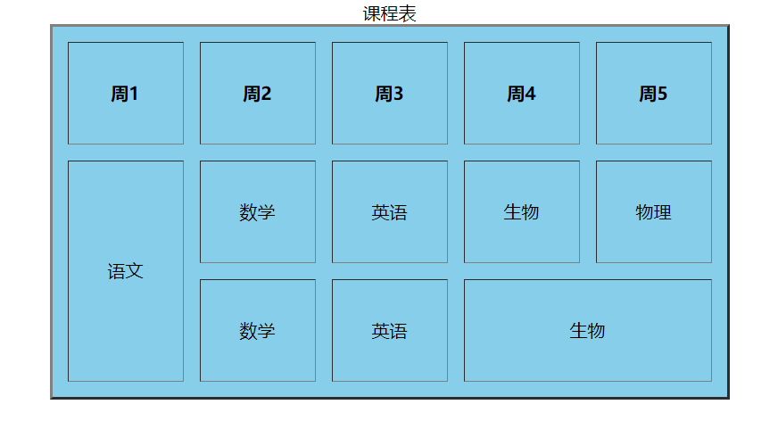
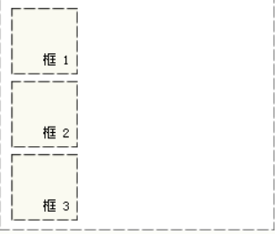
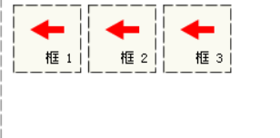

##HTML------
(超文本标记语言)
####常见的标签:
div  &emsp; span &emsp;\<p\> &emsp; h1-h6标签 &emsp; img标签&emsp;a标签&emsp;\<br\>换行标签&emsp; \<hr\> &emsp; \<button\>
######转义字符:
空格 \&nbsp\;或者\&#160\;  &emsp;小于号 \&lt\;或者\&#60\; &emsp; 大于号 \&gt\; 或者\&#62\;  &emsp;\<em\>斜体 &emsp; sub和sup上下文字表达等
\<strong\>加粗

######无序列表:
ul (父集)>li \<\/ul>
列如: &emsp;&emsp;&emsp;&emsp;&emsp;```<ul><li>苹果</li><li>梨子</li><li>香蕉</li></ul>```
######有序列表:
ol (父集)>li \<\/ol>
列如: &emsp;&emsp;&emsp;&emsp;&emsp;```<ol><li>苹果</li><li>梨子</li><li>香蕉</li></ol>```
###表格
tr包裹表头和内容 &emsp;&emsp;表头用th&emsp;&emsp; 内容填充用td &emsp;table用于标签开头和结束
caption 为表格的标题 在th上方使用
```
<table align="center" border="2px" bgcolor="skyblue" cellspacing="15px" cellpadding="35pxs">
<caption>课程表</caption>
<tr>
<th>周1</th>
<th>周2</th>
<th>周3</th>
<th>周4</th>
<th>周5</th>
</tr>
<tr>
<td rowspan="2">语文</td>
<td>数学</td>
<td>英语</td>
<td>生物</td>
<td>物理</td>
</tr>
<tr align="center">
<td>数学</td>
<td>英语</td>
<td colspan="2">生物</td>
</tr>
</table>
```
显示的图片如下

###表单
#####select下拉标签  &emsp;
#####input标签(type可以设置各种属性值):
	定义常规文本输入。
radio	定义单选按钮输入（选择多个选择之一）
submit	定义提交按钮（提交表单）
|列如  |   --- |
| ---- |  -----|
| text  |  文字信息 |
| radio  |  单选框 |
|      password   |    密码框   |
|    button    |    按钮    |
checkbox复选框 &emsp;file文件域等; &emsp; &emsp; &emsp;其中checked可以设置默认设置区;disabled 禁用此元素。 &emsp; &emsp;value: input 元素的值  &emsp; placeholder用于提示用户填写用
#####textarea用于多行文本

###CSS ----
(层叠样式表)

####CSS选择器:  &emsp;
```
p{color: red;}/* 标签选择器 */
.class{color: black;}/* 类别选择器*/
#demoDiv{color:#FF0000;}/* ID选择器*/
*{  }/*通用选择器*/
a:hover/*伪类选择器 */
```
其中包括一些复合选择器
后代选择器: .a .c 中间用空格隔开 &emsp;
并集选择器:.a,.b 用,连接不需要空格&emsp;
交集选择器用的不多,需要一个标签选择器和一个类别选择器,选取出里面相同的元素
#####css的属性
margin控制盒子和盒子的间隙&emsp;&emsp;padding控制盒子和边框的间隙
border盒子的边框   &emsp;&emsp;&emsp;&emsp;&emsp;&emsp;&emsp;还有就是盒子自身内容的大小啦
**css的样式**
背景: background:背景色 背景图 no-repeat center
文本: text-alingn:center 水平居中  &emsp;&emsp;text-indent首行缩进&emsp; &emsp;&emsp;&emsp;line-height 行高 &emsp; &emsp;&emsp;text-decoration&emsp;下划线
伪类连接 :&emsp; &emsp; a:link {color:#FF0000;}		/* 未被访问的链接 */
a:visited {color:#00FF00;}	/* 已被访问的链接 */
a:hover {color:#FF00FF;}	/* 鼠标指针移动到链接上 */
a:active {color:#0000FF;}	/* 正在被点击的链接 */

***CSS 定位和浮动***

相对定位---------绝对定位----------固定定位
只有相对定位是固定的文档流,其余是脱标的.
| 属性  |  描述 |
| ---- |  ---- |
| position |   定位位置使用 |
| top/right/bottom/left/|   方向上右下左 |
| overflow:hidden  |  溢出隐藏 |
| vertical-align| 元素的垂直对齐方式  |
|z-index |元素显示的优先顺序 |

#####浮动
浮动都是脱落文档流的哦,所以必须要考虑到浮动产生的影响,给父集盒子足够的宽和高
如图这是固定的文档流
如图这是已经向左浮动的盒子

####以下是一些布局的小技巧

#####关于图标排列的方法
1、当使用ul和li的格式排版时,可以对li设置背景图 ul{….;list-style-type:none;….}
li{….;background:url(背景图标) no-repeat 0px 0px;….}
----0px,0px则是定位图片显示的坐标。

2、可以对图标进行样式定义，设定img属性margin或padding的值；

3、可以在图片中使用align=\"absmiddle\"来让图片绝对居中，alibaba英文网站上很多都是这样排版的。

4、使用定位的通用方法（外层设置相对位置属性，内层设置绝对位置属性，设置\"top:50%;marign-top:-x/2;\"，x为内层的高度）
#####关于布局的格式
1、确定页面版心
2、分析页面中的行模块，以及每一个行模块中的列模块
3、制作HTML结构
4、CSS初始化，然后通过盒子模型远离，通过DIV+CSS布局来控制网页每个模块
#####关于嵌套崩塌
可以给父集设置足够的宽高
可以给父集设置overflow:hidden;
设置一个空的div,并给他设置

